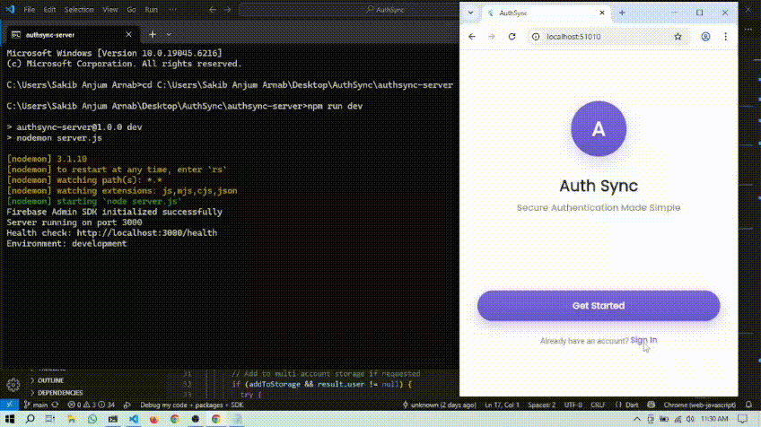
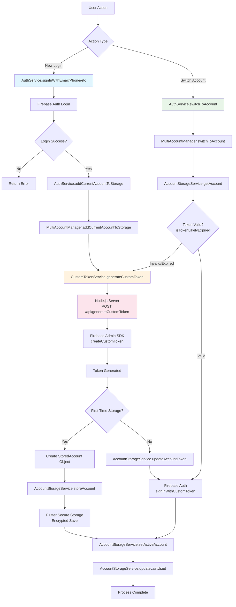

# AuthSync

A comprehensive Flutter authentication app with Firebase integration and custom multi-account switching functionality.

## Features

- **Standard Authentication**: Email/Password, Google, Facebook, Phone
- **Account Management**: Sign up, Password reset, Email verification, Account deletion
- **Multi-Account System**: Custom implementation for multiple account switching
- **Secure Storage**: Encrypted local storage with automatic token cleanup
- **Server Integration**: Node.js backend with Firebase Admin SDK

## Preview



## Architecture Overview



## Server Setup

### Prerequisites
- Node.js 14+
- Firebase Project with Admin SDK and Service Account Key

### Installation

1. **Clone and install dependencies**
```bash
cd server
npm install express firebase-admin cors express-rate-limit helmet dotenv
```

2. **Environment Setup**
Create `.env` file:
```env
PORT=3000
NODE_ENV=production
FIREBASE_PROJECT_ID=your-project-id
FIREBASE_SERVICE_ACCOUNT_KEY={"type":"service_account",...}
```

3. **Service Account Key**
- Download from Firebase Console → Project Settings → Service Accounts
- Either place as `serviceAccountKey.json` or set in `.env`

4. **Start Server**
```bash
npm start
```

### API Endpoints
- `GET /health` - Health check
- `POST /api/generateCustomToken` - Generate custom token
- `GET /api/userProfile/:uid` - Get user profile

## Flutter Setup

### Dependencies
```yaml
dependencies:
  firebase_auth: ^4.10.1
  flutter_secure_storage: ^9.0.0
  http: ^1.1.0
```

### Usage Example

```dart
// Initialize
final authService = AuthService();
await authService.initializeMultiAccount();

// Sign in and store account
await authService.signInWithEmail(
  email: 'user@example.com',
  password: 'password',
  addToStorage: true,
  accountLabel: 'Work Account',
);

// Switch accounts
final response = await authService.switchToAccount(uid);
if (response.result == AccountSwitchResult.success) {
  // Account switched successfully
}

// Get all stored accounts
final accounts = await authService.getAllStoredAccounts();
```

## Security Features

- **Token Encryption**: Local storage with `flutter_secure_storage`
- **Server Validation**: ID token verification for all requests
- **Rate Limiting**: 100 requests per 15 minutes per IP
- **Auto Cleanup**: Expired tokens removed automatically
- **Secure Headers**: Helmet.js security middleware

## Key Classes

| Class | Purpose |
|-------|---------|
| `AuthService` | Main authentication interface |
| `MultiAccountManager` | Account switching logic |
| `AccountStorageService` | Encrypted local storage |
| `CustomTokenService` | Server communication |
| `StoredAccount` | Account data model |
